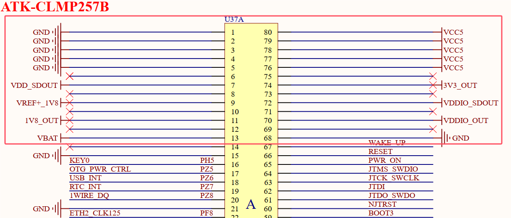
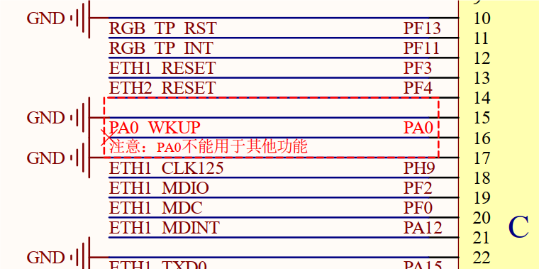
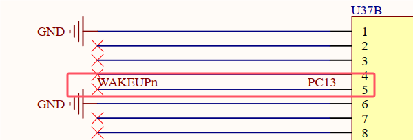

# 3.2 核心板对接接口注意事项 

&emsp;&emsp;下面说明使用该核心板接口设计产品时注意事项。

&emsp;&emsp;1、ATK-CLMP257B核心板电源输入、输出说明；

 
图3.2.1核心板电源输入输出定义

&emsp;&emsp;表3.2.1 核心板电源输入输出说明表

| 电源定义    | 电源方向 | 电压值   | 作用                        | 使用说明                                                     |
| ----------- | -------- | -------- | --------------------------- | ------------------------------------------------------------ |
| VDD_SDOUT   | 输出     | 3.3V     | 专用TF卡电源                | 供电TF卡                                                     |
| VREF+_1V8   | 输入     | 1.8V     | ADC参考电源                 | 核心板已内部供电1.8V，不需重复输入该电源                     |
| 1V8_OUT     | 输出     | 1.8V     | 核心板对外提供1.8V电源      | 建议最大使用电流不超过300mA                                  |
| VBAT        | 输入     | 3V/3.3V  | 处理器内部RTC电源           | 当使用处理器内部RTC时才需要供电，否则使用独立RTC芯片时不需输入该电源 |
| VCC5        | 输入     | 5V       | 供电给核心板                | 输入电流应大于500mA                                          |
| 3V3_OUT     | 输出     | 3.3V     | 核心板对外提供3.3V电源      | 建议最大使用电流不超过300mA                                  |
| VDDIO_SDOUT | 输出     | 1.8/3.3V | 专用TF卡电源                | 供电TF卡                                                     |
| VDDIO_OUT   | 输出     | 3.3V     | 核心板VDDIO电源对外提供3.3V | 建议最大使用电流不超过300mA                                  |

&emsp;&emsp;2、对个别特殊GPIO进行使用说明。

&emsp;&emsp;（1）PA0引脚在ATK-CLMP257B核心板中已被占用，用于WAKE UP唤醒功能，用户设计产品时，在非特殊定制核心板条件下，请勿再次使用引脚PA0。

 
图3.2.2 PA0引脚

&emsp;&emsp;（2）PC13引脚同样在ATK-CLMP257B核心板中已被占用，用户设计产品时，在非特殊定制核心板条件下，请勿再次使用引脚PC13。

 
图3.2.3 PC13引脚

