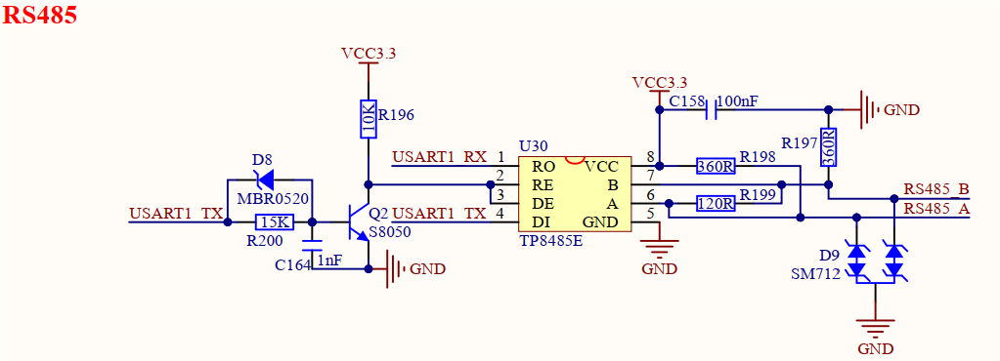

# 3.20 RS485接口

&emsp;&emsp;开发板板载1路RS485接口，原理图如下图所示。

 
图3.20 RS485接口

&emsp;&emsp;开发板使用TP8485E芯片实现RS485通信功能，其他型号RS485芯片均可。RS485设备通信时，需要板载端口RS485_A接对方设备端口A，板载端口RS485_B接对方设备端口B。该电路中，通过将TP8485E芯片RE和DE引脚连接到USART1_TX引脚上，实现RS485接收和发送状态的自动切换，完全将RS485当做一个串口来使用。需注意的是，这种自动控制RS485收发状态方式，不能过快收发数据，一般建议不超过115200波特率。若需要提升RS485通信速率，则建议使用独立GPIO来控制RE、DE引脚。该电路添加静电防护器件，提升电路可靠性。

