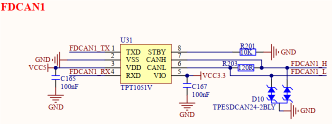
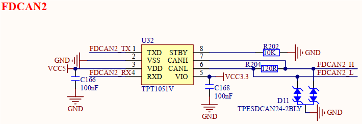
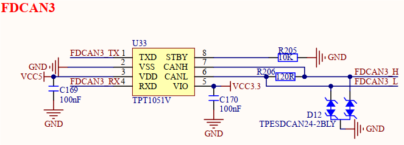
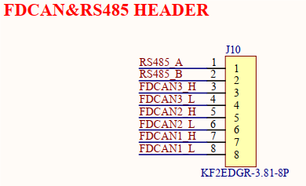

# 3.21 FDCAN接口

&emsp;&emsp;开发板板载3路FDCAN接口，原理图如下图所示。

 
图3.21.1 FDCAN1接口

 
图3.21.2 FDCAN2接口

 
图3.21.3 FDCAN3接口

&emsp;&emsp;开发板使用TPT1051V芯片实现CAN通信功能，支持CAN、CAN-FD（5Mbps）协议，其他型号支持CAN、CAN-FD芯片均可。该电路添加静电防护器件，提升电路可靠性。

&emsp;&emsp;该3路FDCAN接口和1路RS485接口，通过8PIN插拔式接线端子引出。

 
图3.21.4 FDCAN & RS485接口端子

