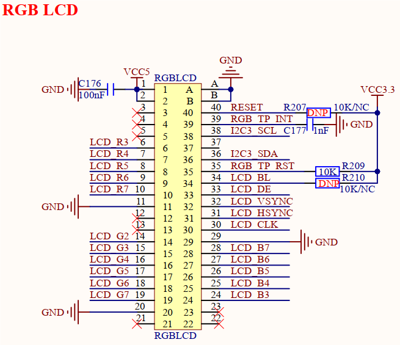

# 3.22 RGB接口

&emsp;&emsp;开发板板载1路RGB LCD屏幕接口，原理图如下图所示。

 
图3.22 RGB接口

&emsp;&emsp;开发板采用一个40PIN FPC连接器对外引出1路RGB接口，支持触摸，I2C接口。
该接口可连接正点原子RGB LCD触摸屏幕，已适配支持4.3寸800x480、7寸800x480、7寸1024x600、10.1寸1280x800分辨率屏幕。

&emsp;&emsp;由于开发板默认设计功能较多，该RGB接口受限于GPIO引脚数量，仅使用RGB R3~R7、G2~G7、B3~B7共16个IO作RGB显示接口，故该接口仅支持RGB LCD屏幕RGB565格式。LCD_BL引脚为屏幕背光引脚，LCD_DE、LCD_VSYNC、LCD_HSYNC、LCD_CLK引脚为数据使能、帧同步信号、行同步信号和时钟信号引脚。

&emsp;&emsp;触摸功能使用RGB_TP_INT、RGB_TP_RST、I2C3_SDA和I2C3_SCL四根信号引脚，用于触摸芯片的中断、复位和通信。

&emsp;&emsp;RESET引脚为屏幕的复位信号。

