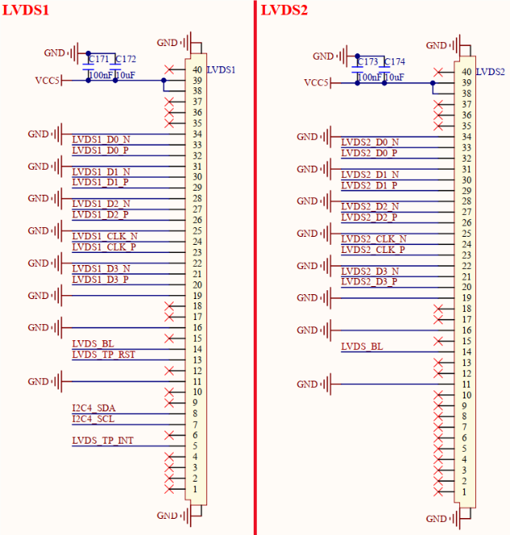

# 3.23 LVDS接口  

&emsp;&emsp;开发板板载2路LVDS接口，原理图如下图所示。

 
图3.23 LVDS接口

&emsp;&emsp;开发板采用2个40PIN FPC连接器对外引出2路LVDS接口，其中LVDS1接口支持I2C接口触摸，LVDS2接口仅支持显示，不支持触摸。该LVDS接口均为4通道，可连接正点原子LVDS LCD触摸屏幕，已适配支持10.1寸1280x800分辨率 LVDS屏幕。

&emsp;&emsp;LVDS1接口支持单独使用，独立接入单块LVDS屏幕进行显示、触摸。

&emsp;&emsp;LVDS2接口支持与LVDS1接口共同使用，支持LVDS1和LVDS2双屏同显，当开发板接入2块LVDS屏幕时，LVDS2接口屏幕能够显示和LVDS1接口屏幕一致的内容，而触摸时只能操作LVDS1接口屏幕来控制2个屏幕显示内容。提示，当LVDS2和LVDS1接口做双屏同显功能时，建议接入同一款型号的LVDS屏幕，这样屏幕参数能保持一致。

&emsp;&emsp;LVDS2接口还支持与LVDS1接口形成8通道，接入单块8通道LVDS屏幕进行显示。

&emsp;&emsp;LVDS1_D0、LVDS1_D1、LVDS1_D2、LVDS1_D3和LVDS1_CLK信号分别为LVDS1数据、时钟差分对引脚，LVDS_BL信号为LVDS屏幕背光引脚， LVDS_TP_INT、LVDS_TP_RST、I2C4_SDA、I2C4_SCL信号分别为触摸芯片的中断、复位、通信引脚。

&emsp;&emsp;LVDS2_D0、LVDS2_D1、LVDS2_D2、LVDS2_D3和LVDS2_CLK信号分别为LVDS2数据、时钟差分对引脚，LVDS2屏幕背光引脚使用LVDS_BL信号，和LVDS1屏幕背光共用。

