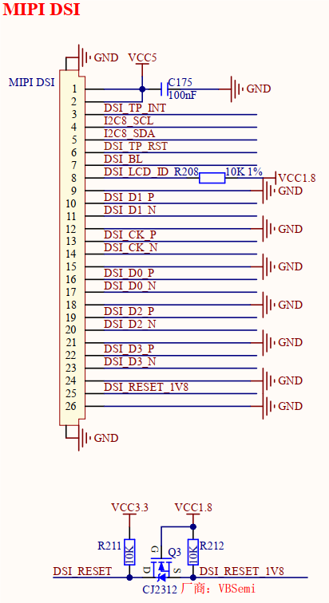

# 3.24 MIPI DSI接口 

&emsp;&emsp;开发板板载1路MIPI DSI接口，原理图如下图所示。

 
图3.24 MIPI DSI接口

&emsp;&emsp;开发板采用1个26PIN立式翻盖FPC连接器对外引出1路4通道 MIPI DSI屏幕接口，支持I2C接口触摸，连接器型号为FH12-26S-0.5SVA。该接口可连接正点原子MIPI LCD触摸屏，已适配支持5.5寸720x1280、5.5寸1080x1920、10.1寸800x1280分辨率 MIPI DSI屏幕。

&emsp;&emsp;DSI_D0、DSI_D1、DSI_D2、DSI_D3、DSI_CK信号分别为MIPI DSI数据、时钟差分对引脚，DSI_BL信号为MIPI DSI屏幕背光引脚， DSI_TP_INT、DSI_TP_RST、I2C8_SDA、I2C8_SCL信号分别为触摸芯片的中断、复位、通信引脚。

&emsp;&emsp;DSI_LCD_ID信号为正点原子MIPI屏幕ID值的ADC电压采样引脚，正点原子MIPI屏幕有不同分辨率尺寸，屏幕上通过使用1%精度的上下拉电阻产生不同电压值来作为屏幕ID码（屏幕ID为1.8V电阻分压，具体可查看屏幕原理图），以此来区分不同分辨率尺寸屏幕。故DSI_LCD_ID信号为ADC功能，采样屏幕ID电压值。

&emsp;&emsp;DSI_RESET信号为屏幕复位引脚，正点原子MIPI屏幕要求该引脚为1.8V电平，故添加3.3V转换1.8V电路，将DSI_RESET复位引脚电平转换为1.8V。

&emsp;&emsp;注意，在该接口设计中，DSI_LCD_ID引脚默认上拉1%精度10K电阻至1.8V，当开发板不接任何屏幕时，DSI_LCD_ID引脚ADC电压采样值默认为1.8V。该设计会与正点原子MIPI屏幕自身的ID分压电阻形成并联，进而影响接入屏幕时的屏幕ID原本电阻分压值，故屏幕ID电压值不仅仅只看屏幕本身ID电压值，还需接合接口电路不同设计来最终确定。

&emsp;&emsp;若其他品牌屏幕没有ID设计，则不必使用该引脚功能，移除即可。

