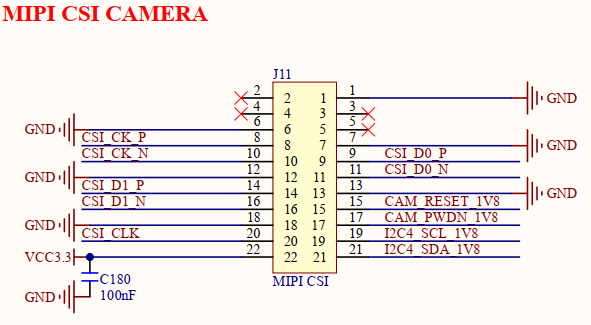
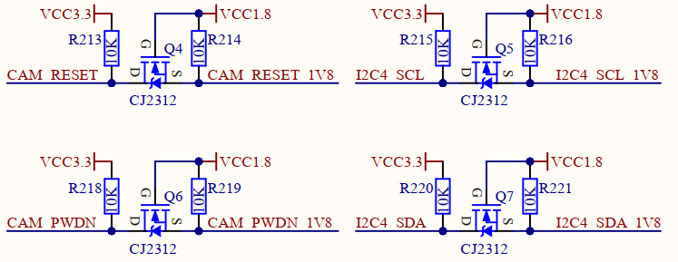
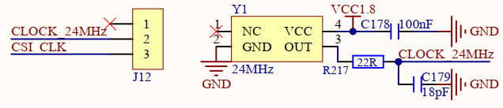

# 3.25 MIPI CSI接口   

&emsp;&emsp;开发板板载1路MIPI CSI接口，原理图如下图所示。

 
图3.25.1 MIPI CSI接口

 
图3.25.2 电平转换电路

 
图3.25.3 24MHz时钟电路

&emsp;&emsp;开发板采用一个2x11P、2.0mm间距排母对外引出一路2通道MIPI CSI摄像头接口，支持带ISP的MIPI CSI摄像头，用于图像采集、处理。该接口适配支持正点原子IMX335摄像头模块，可将摄像头模块插入到该接口使用，镜头方向向外侧。

&emsp;&emsp;正点原子IMX335摄像头模块控制引脚和I2C引脚工作电压是1.8V，故该电路对CAM_RESET、CAM_PWDN、I2C4_SCL、I2C4_SDA四个引脚进行3.3V转1.8V电平转换。

&emsp;&emsp;正点原子IMX335摄像头模块工作时，需要外部提供24MHz时钟，该电路使用1.8V有源晶振提供24MHz时钟，并使用J12排针进行连接，若用户插入自带晶振提供时钟的摄像头模块，则需断开J12排针连接。

