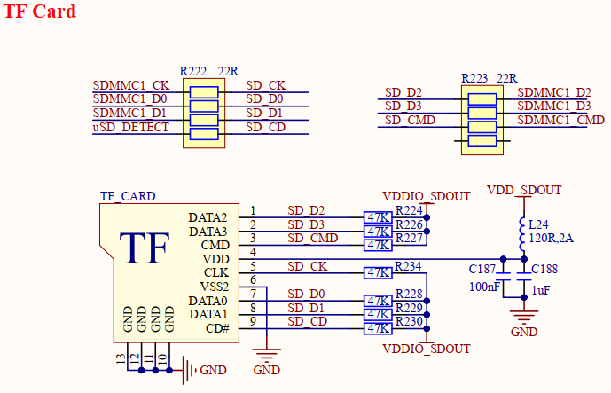

# 3.26 TF卡接口     

&emsp;&emsp;开发板板载1路TF卡接口，原理图如下图所示。

 
图3.26 TF卡接口

&emsp;&emsp;开发板提供1路9PIN TF卡接口，采用标准TF卡连接器，SDMMC接口类型，通过SDMMC1总线连接到核心板STM32MP257处理器。

&emsp;&emsp;SDMMC1_D0、SDMMC1_D1、SDMMC1_D2、SDMMC1_D3、SDMMC1_CMD、SDMMC1_CK六个引脚为TF卡数据、命令和时钟信号引脚，uSD_DETECT引脚为TF卡热插拔检测引脚，VDD_SDOUT为TF卡供电电源，VDDIO_SDOUT为TF卡通信引脚电源，这两个电源由核心板电源管理芯片PMIC输出，专用于TF卡电路，能够根据TF卡速率类型进行3.3V和1.8V电平切换，实现高速数据传输。

