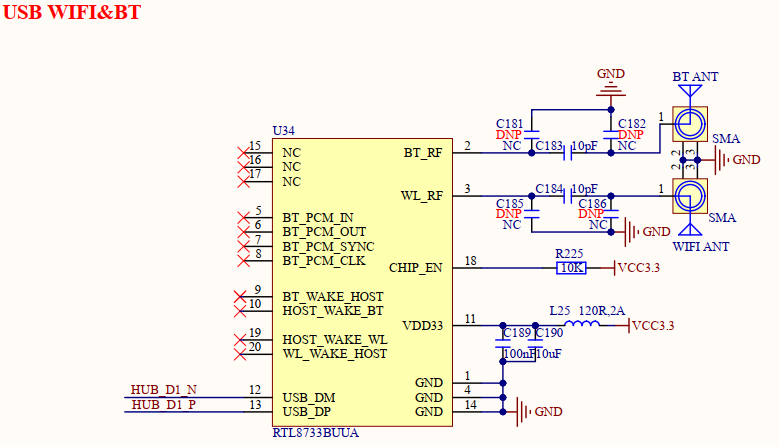

# 3.27 WIFI&蓝牙接口 

&emsp;&emsp;开发板板载1路WIFI天线接口和1路蓝牙天线接口，原理图如下图所示。

 
图3.27 WIFI&蓝牙模块电路

&emsp;&emsp;开发板采用1个WIFI&蓝牙一体模组提供WIFI和蓝牙无线连接功能，模组型号为创凌智联TL8733BUUA，该模组使用瑞昱(REALTEK)公司的RTL8733BU芯片，USB2.0接口，支持WIFI4无线双频2.4G/5.8G和蓝牙5.2版本协议。该模块支持双天线，也支持WIFI和蓝牙共用一根天线，开发板采用双天线设计。另外由于该模组支持5.8G频段WIFI，故使用WIFI功能时建议使用2.4G/5.8G双频天线，蓝牙为2.4G频段天线。

