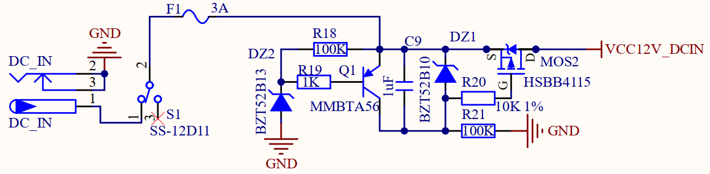
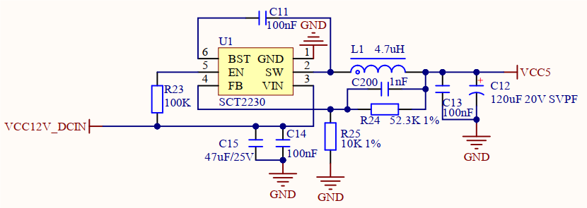
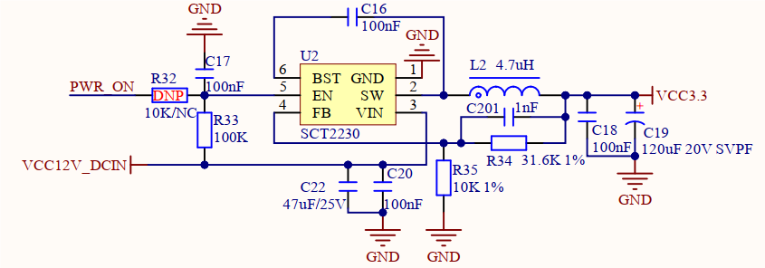
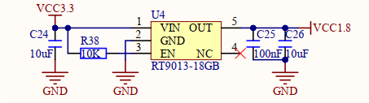
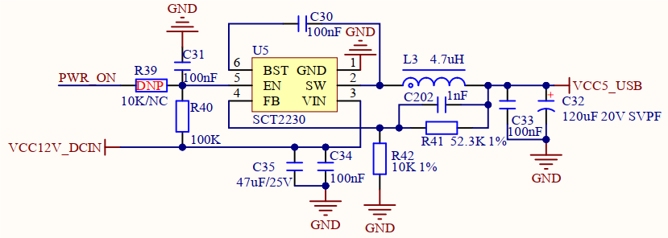

# 3.3 直流电源供电

&emsp;&emsp;开发板板载12V直流电源供电电路，原理图如下图所示。

 
图3.3.1 直流12V电源供电

 
图3.3.2 5V电源供电

 
图3.3.3 3.3V电源供电

 
图3.3.4 1.8V电源供电

 
图3.3.5 USB设备5V电源供电

&emsp;&emsp;图3.3.1是整个开发板的12V直流电源输入接口，具有防反接和12V 稳压功能。

&emsp;&emsp;图3.3.2是供电核心板的 5V 电源，将输入的12V直流电源经过DC-DC芯片U1（SCT2230）转换为5V电源输出，对核心板进行供电。同时也供电给底板需要5V电源的外设，例如屏幕、CAN通信等外设电路。

&emsp;&emsp;图3.3.3是开发板的3.3V电源，将输入的12V 电源经过 DC-DC 芯片U2（SCT2230）转换为3.3V输出，这个3.3V就是整个底板的3.3V电源。

&emsp;&emsp;图3.3.4是开发板的1.8V电源，作为底板1.8V外设所使用的电源。

&emsp;&emsp;图3.3.5是供电USB设备的5V电源，开发板板载2路USB Type-A座用于连接外部USB设备，该电路对外部USB设备进行独立供电。

