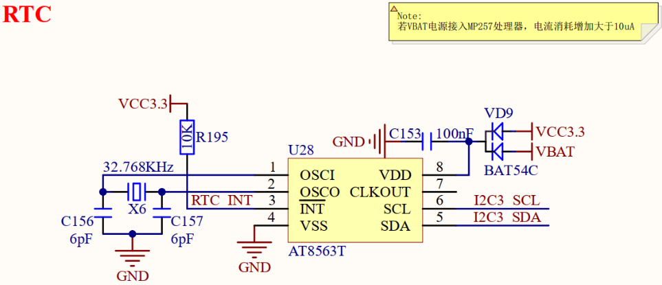
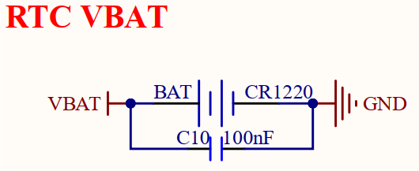
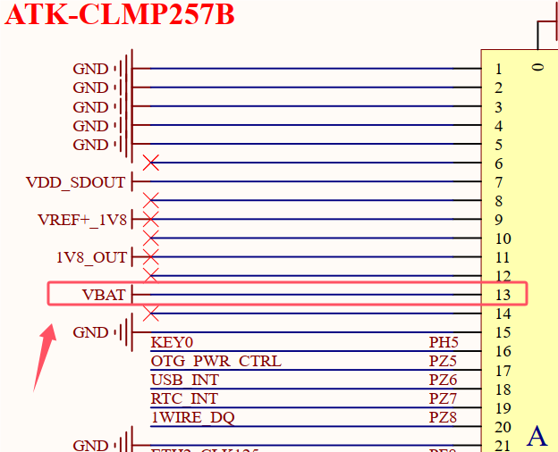

# 3.30 RTC实时时钟 

&emsp;&emsp;开发板板载一个RTC实时时钟芯片，型号为AT8563T，I2C接口通信，原理图如下图所示。

 
图3.30.1 RTC电路

 
图3.30.2 RTC纽扣电池电源

&emsp;&emsp;开发板采用一个外置RTC实时时钟芯片，实现外部RTC计时功能，由32.768KHz无源晶振产生计时滴答。该电路采用双供电方式实现不间断供电，由板载电源3.3V和一颗3V纽扣电池CR1220对RTC芯片进行供电切换。当由板载电源3.3V供电时，纽扣电池CR1220不会向RTC芯片供电；当板载电源3.3V断电时，则由纽扣电池CR1220 向RTC芯片供电3V。这样，RTC芯片VDD电源总是有电的，以保证RTC计时。若用户需要严格计时准确，则建议使用特性更好的晶振提供精确时钟。

&emsp;&emsp;关于RTC电流消耗方面，此处特别提示：

&emsp;&emsp;核心板STM32MP257处理器具有内部RTC功能，即使不外接外部RTC芯片，也能实现内部RTC计时功能，但是电流消耗大于外置RTC芯片，故当用户产品需要使用RTC功能时，特别是低功耗的应用，推荐使用外置RTC芯片。

&emsp;&emsp;由于STM32MP257处理器具有VBAT低功耗运行模式，当核心板断电后，处理器进入该模式，VBAT电池将供电处理器VSW备份电源域（供电给内部RTC等外设），因此该电池电流消耗将比仅供电外置RTC芯片要加大。

&emsp;&emsp;在开发板设计中，当板载电源3.3V断电时，该RTC纽扣电池除了向RTC AT8563T芯片供电外，还输入了到核心板STM32MP257处理器，供电给处理器内部RTC等外设。经测试，此设计会增加电流消耗至10uA以上，故当用户产品选择不使用处理器内部RTC功能时，可以不用将纽扣电池电源VBAT输入至核心板处理器，仅供电外置RTC芯片即可，即BTB连接座VBAT引脚保持空置，这样能降低纽扣电池电流消耗，延长电池供电周期。

&emsp;&emsp;具体RTC纽扣电池功耗与产品应用有关，涉及使用低功耗RTC芯片型号、RTC电路设计等，可查阅相关数据手册。

 
图3.30.3 BTB连接座纽扣电池VBAT供电引脚

