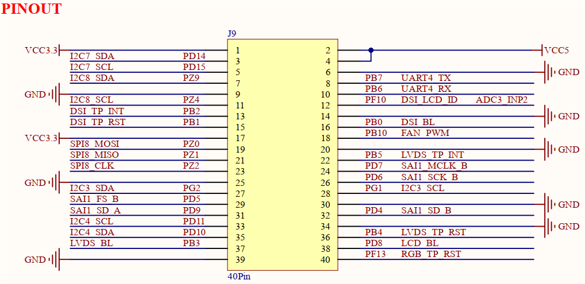

# 3.31 引出IO排针组

&emsp;&emsp;开发板板载一组引出IO排针组，原理图如下图所示。

 
图3.31 引出IO排针组

&emsp;&emsp;开发板通过一组40PIN、2.5mm间距排针组，引出部分GPIO及5V、3.3V和GND引脚。用户可以使用这些GPIO引脚连接一些其他模块，进行更多有意思的创新。这里特别提示，这些引出GPIO口并非独立使用，几乎全部与开发板板载功能电路引脚共用。故用户在使用这些引出GPIO时，需检查底板功能电路对这些GPIO的配置情况，比如是否进行电阻上下拉、是否并联电容、是否软件程序已占用等，若影响使用，则需要更改、移除。

&emsp;&emsp;此处举例，比如UART4_TX和UART4_RX引脚，在开发板中这2个引脚被默认用作Cortex-M33核调试串口，所以当用户必须使用这2个引脚时，就需要更改Cortex-M33核程序配置，更换为其他调试串口，这时UART4_TX和UART4_RX引脚才能用作其他用途。

