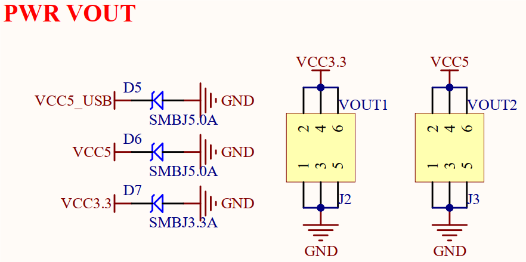

# ## 3.4 电源输出接口

&emsp;&emsp;开发板板载两组电源输出接口，原理图如下图所示。

 
图3.4 电源输出接口

&emsp;&emsp;图中VOUT1和VOUT2分别是3.3V和5V的电源输出接口，可以通过开发板给外部提供 3.3V和5V电源，方便用户进行扩展使用。图中D6和D7为TVS管，可以有效避免VOUT外接电源/负载不稳的时候（尤其是开发板外接电机/继电器/电磁阀等感性负载的时候），对开发板造成的损坏。同时还能一定程度防止外接电源接反，对开发板造成损坏。开发板默认配套DC 12V-1A电源适配器，供电能力有限，该电源输出接口建议不外接大功率设备。

