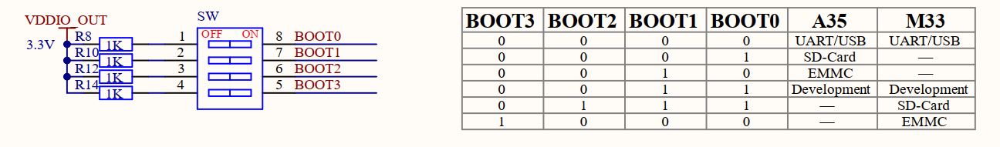

# 3.5 启动模式设置接口

&emsp;&emsp;开发板板载BOOT启动模式设置接口电路，原理图如下图所示。

 
图3.5 启动模式设置接口

&emsp;&emsp;核心板STM32MP257处理器支持多种启动方式，支持从EMMC、SD卡、USB模式启动，还支持Development调试模式。本电路中，使用核心板引出的VDDIO_OUT电源（3.3V）对四个BOOT引脚进行上拉，当指定拨码拨至ON选项时，即连通拨码开关两侧电位，此时对应BOOT引脚为高电平，即配置为“1”，否则为“0”。根据不同BOOT引脚的“1”或“0”配置，实现启动模式的切换。底板支持的模式为以下配置：

&emsp;&emsp;表3.5 启动模式配置

| **BOOT3** | **BOOT2** | **BOOT1** | **BOOT0** | **启动核**       | **启动模式** |
| --------- | --------- | --------- | --------- | ---------------- | ------------ |
| 0         | 0         | 0         | 0         | Cortex-A35       | USB启动      |
| 0         | 0         | 0         | 1         | Cortex-A35       | SD卡启动     |
| 0         | 0         | 1         | 0         | Cortex-A35       | EMMC启动     |
| 0         | 0         | 1         | 1         | Development boot |              |
| 0         | 0         | 0         | 0         | Cortex-M33       | USB启动      |
| 0         | 1         | 1         | 1         | Cortex-M33       | SD卡启动     |
| 1         | 0         | 0         | 0         | Cortex-M33       | EMMC启动     |

&emsp;&emsp;注意BOOT引脚序号排序，不要拨反顺序。

&emsp;&emsp;当核心板STM32MP257处理器处于USB启动模式时，为烧写模式，可进行系统镜像重新烧写，根据软件配置来选择烧写进EMMC存储芯片或者SD卡；当处理器处于EMMC启动模式时，处理器会读取存储在EMMC芯片里的系统镜像固件来启动运行；当处理器处于SD卡启动模式时，处理器会读取存储在SD卡里的系统镜像固件进行启动运行；当核心板处理器处于Development启动模式时，处理器会进入调试状态。

&emsp;&emsp;另外，关于BOOT引脚上拉电源，建议参考本电路，使用从核心板引出的VDDIO_OUT电源对BOOT引脚进行供电，而不是使用其他板载3.3V电源，如果使用其他板载3.3V电源上电速度过慢，则可能会导致处理器读取BOOT启动模式电平失败，从而导致启动系统镜像失败。

