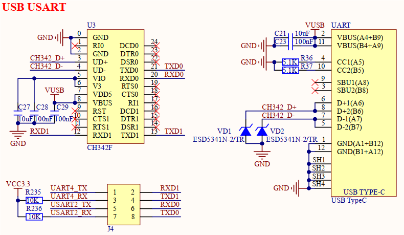

# 3.6 UART调试串口（系统调试）

&emsp;&emsp;开发板板载一个UART调试串口，USB Type-C接口类型，原理图如下图所示。

 
图3.6 UART调试串口

&emsp;&emsp;核心板STM32MP257处理器为异核处理器，Cortex-A35核和Cortex-M33核使用独立调试串口，故开发板设计有2个调试串口，其中USART2串口为Cortex-A35核调试串口，UART4为Cortex-M33核调试串口。该电路中，使用CH342F USB转接芯片，实现USB转2个异步串口功能，因此用户只需一根USB线即可使用2个调试串口来进行调试信息的数据收发。

&emsp;&emsp;图中U3为CH342F芯片，通过USB线进行独立供电，当开发板UART接口接入USB Type-C线时，可以直接给CH342F芯片供电5V。

