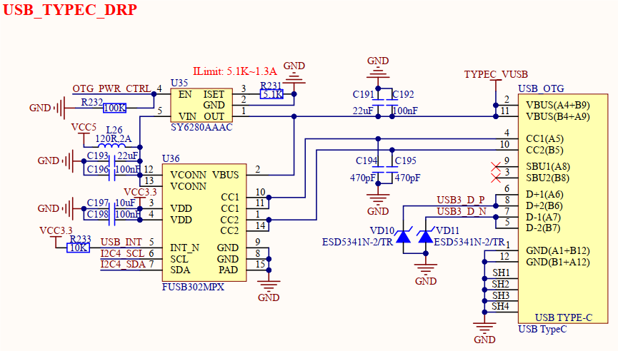

# 3.7 USB_OTG接口（系统烧写）

&emsp;&emsp;开发板板载一个USB_OTG接口，USB Type-C接口类型，原理图如下图所示。

 
图3.7 USB_OTG接口

&emsp;&emsp;核心板STM32MP257处理器支持从USB模式启动，进行系统镜像固件烧写。在本电路中，该USB_OTG接口既可以当系统镜像固件烧写接口，也可以插入USB OTG线，接入USB HOST设备进行使用，具备USB主从机双角色转接功能。

&emsp;&emsp;该电路中，使用可编程USB Type-C控制器芯片FUSB302MPX实现USB主从机双角色转换，通过I2C接口进行配置控制。USB属于热插拔设备，USB_INT这个中断引脚主要是检测有没有设备接入，有设备接入时该引脚电平会被拉低，系统驱动软件会进入相应处理函数，判断主从机状态。当处理器识别当前处于host主机模式时，会将OTG_PWR_CTRL引脚拉高，进而打开SY6280AAAC限流开关芯片，对外部设备输出5V进行供电；当处理器识别当前处于device从机模式时，会将OTG_PWR_CTRL引脚拉低，进而关闭SY6280AAAC限流开关芯片，不会对外输出5V。

