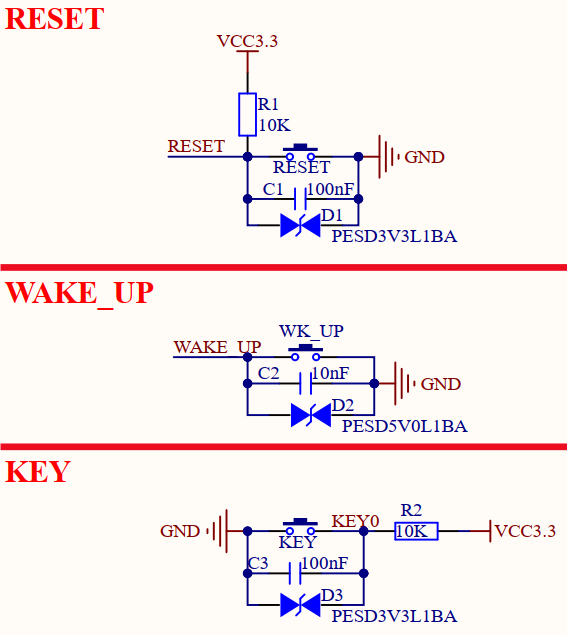

# 3.8 按键（复位、唤醒、用户）

&emsp;&emsp;开发板板载3个机械按键，原理图如下图所示。

 
图3.8 按键

&emsp;&emsp;各个按键功能如下：

&emsp;&emsp;**1、RESET复位按键**用于复位核心板，RESET引脚连接到了核心板STM32MP257处理器的NRST引脚和核心板PMIC电源管理芯片的RSTn控制引脚，可以同时复位电源管理芯片和处理器，进而让处理器、DDR4、EMMC、PMIC等所有器件重新上电。复位电平为低电平有效。

&emsp;&emsp;**2、WAKE_UP唤醒按键**用于唤醒处理器，WAKE_UP引脚连接到了核心板PMIC电源管理芯片的PONKEYn引脚，当用户对处理器执行休眠操作后，可通过该按键对处理器进行唤醒。低电平有效。

&emsp;&emsp;注意，在核心板设计中，该唤醒按键引脚是通过控制PMIC电源管理芯片，再通过连接中断引脚PA0，来唤醒STM32MP257处理器。核心板已占用PA0引脚，故用户在非特殊定制条件下，设计底板产品时，不建议再使用PA0引脚，建议将PA0引脚空置。

&emsp;&emsp;**3、KEY用户按键**用于普通按键操作，用户可自定义按键功能。

